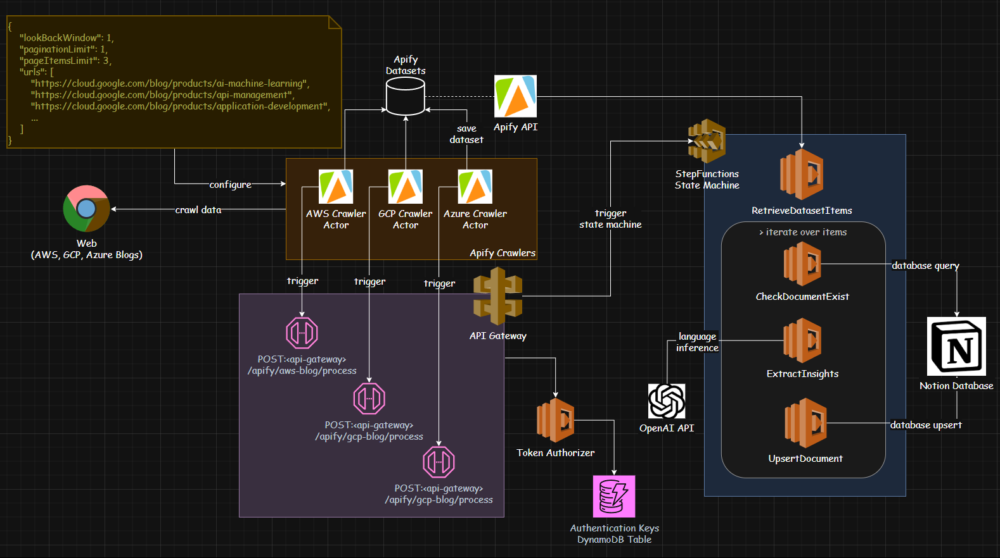

## Project Overview

This repository is a full-stack, cloud-native solution for automating blog summarization and content management using modern serverless technologies. It leverages AWS Step Functions, Lambda, OpenAI, Notion, and Apify to crawl, summarize, and organize blog content, providing scalable automation for cloud architects, ML/AI practitioners, and content managers. The project demonstrates best practices in cloud architecture, serverless deployment, and integration of LLMs (Large Language Models) for real-world automation.

## Main Packages
* [Web (Next.js)](https://github.com/iliazlobin/iliazlobin-sst/tree/master/packages/web)
* [Core](https://github.com/iliazlobin/iliazlobin-sst/tree/master/packages/core)
* [Functions](https://github.com/iliazlobin/iliazlobin-sst/tree/master/packages/functions)


## Features

- **Automated Blog Summarization**: Uses OpenAI and LangChain to extract key insights, takeaways, and technology mentions from blog posts.
- **Content Crawling**: Integrates Apify for scalable web crawling and scraping.
- **Serverless Architecture**: Built on AWS Step Functions, Lambda, API Gateway, and Notion API.
- **Next.js Web Frontend**: Modern UI for presenting summaries and managing content.
- **Custom Authorization**: Secure API endpoints with token-based authentication.
- **Infrastructure as Code**: Uses SST (Serverless Stack Toolkit) and AWS CDK for declarative cloud resource management.
- **Multi-cloud Ready**: Extensible to GCP and Azure blog crawling.
- **CI/CD Ready**: Designed for automated deployment and testing.


## Architecture / Tech Stack

Below is a high-level system design diagram illustrating the main components and data flow:



- **Frontend**: Next.js (React), Tailwind CSS
- **Backend**: AWS Lambda, Step Functions, API Gateway, Notion API, Apify
- **LLM Integration**: OpenAI, LangChain
- **Infrastructure**: SST, AWS CDK, Serverless Framework
- **Testing**: Vitest, custom test suites
- **Other**: Zod (validation), dotenv, custom secrets management

**Description:**  
The architecture features a Next.js frontend for user interaction, which communicates with a serverless backend built on AWS Lambda, Step Functions, and API Gateway. Blog content is crawled using Apify, processed and summarized via OpenAI and LangChain, and stored/organized in Notion. SST and AWS CDK manage infrastructure as code, with secure secrets and environment management. The solution is extensible to multi-cloud crawling and supports automated CI/CD workflows.

## Installation & Setup

### Prerequisites

- Node.js (v18+ recommended)
- pnpm (preferred), npm, or yarn
- AWS account & credentials
- Notion API token
- OpenAI API key
- Apify API token

### Steps

1. **Clone the repository**
  ```bash
  git clone https://github.com/iliazlobin/iliazlobin-sst.git
  cd iliazlobin-sst
  ```

2. **Install dependencies**
  ```bash
  pnpm install
  ```

3. **Set up environment variables**
  - Copy `.env.example` to `.env` and fill in your secrets:
    ```
    APIFY_TOKEN=your_apify_token
    NOTION_TOKEN=your_notion_token
    OPENAI_API_KEY=your_openai_api_key
    ```

4. **Insert secrets into SST**
  ```bash
  npx sst secrets set apifyToken $APIFY_TOKEN
  npx sst secrets set notionToken $NOTION_TOKEN
  npx sst secrets set openaiApiKey $OPENAI_API_KEY
  ```

5. **Run development server**
  ```bash
  pnpm dev
  # or for web frontend
  cd packages/web
  pnpm dev
  ```

6. **Run tests**
  ```bash
  cd packages/core
  pnpm test
  ```

## Usage Examples

### API Usage

**Blog Summarizer Test**
```sh
curl -X POST https://tqnqj3hg8b.execute-api.us-east-1.amazonaws.com/blog/process
curl -X POST -H "Authorization: Bearer _____" https://tqnqj3hg8b.execute-api.us-east-1.amazonaws.com/blog/process
```

**Production Example**
```sh
curl -X POST -d "@packages/functions/blog/files/failing_aws_apify_payload.json" -H "Authorization: Bearer _____" https://cdmujzau4j.execute-api.us-east-1.amazonaws.com/blog/process
```

### Web UI

- Open [http://localhost:3000](http://localhost:3000) to view the Next.js frontend.

## Configuration

- **Environment Variables**: Set in `.env` and loaded via `dotenv`.
- **Secrets**: Managed via SST secrets (`npx sst secrets set ...`).
- **AWS Resources**: Defined in SST/CDK stacks (`stacks/` directory).
- **Notion Integration**: Configure Notion API token and database IDs in environment.

## Development Guide

- **Contributing**: Fork the repo, create a feature branch, submit a PR.
- **Testing**: Use `pnpm test` in relevant package directories.
- **Linting/Formatting**: ESLint and Prettier are recommended; run `pnpm lint` and `pnpm format`.
- **CI/CD**: (Recommended) Set up GitHub Actions for automated deployment and testing.
- **Debugging**: Chrome debug configuration available.

## Deployment

### Local

- Run `pnpm dev` for local development.
- Use SST for local Lambda/API emulation.

### Cloud

- **AWS**: Deploy using SST/CDK (`pnpm deploy` or `sst deploy`).
- **Vercel**: Deploy Next.js frontend via Vercel for production hosting.
- **Serverless Framework**: Optionally use for multi-cloud deployment.

### Example Deployment Flow

1. Develop and test locally.
2. Deploy to AWS using SST/CDK.
3. Set secrets and environment variables.
4. Monitor and manage via AWS Console and Vercel dashboard.

## Additional Resources

- [Next.js Documentation](https://nextjs.org/docs)
- [SST Documentation](https://docs.sst.dev/)
- [AWS CDK Guide](https://docs.aws.amazon.com/cdk/v2/guide/home.html)
- [LangChain](https://langchain.dev/)
- [Apify](https://apify.com/)
