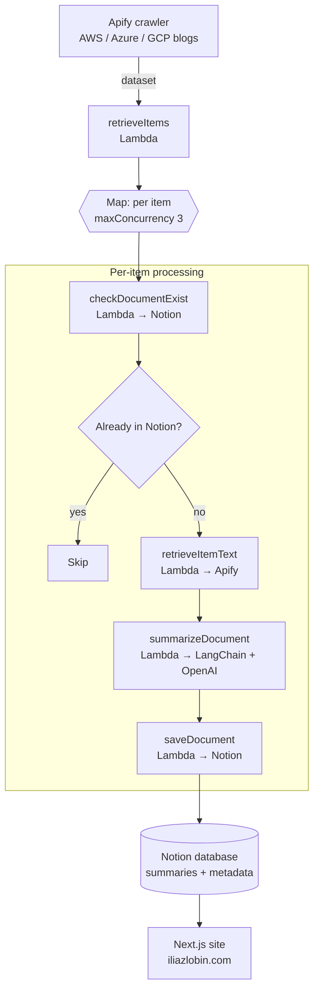

# iliazlobin-sst

> Cloud-native pipeline that crawls AWS/Azure/GCP engineering blogs, summarizes them with an LLM, and publishes structured insights to Notion and a Next.js site — fully defined as infrastructure-as-code.


## Overview

Cloud providers publish far more engineering content than any one person can read. This monorepo automates the
read-and-distill loop: it crawls provider blogs, extracts the article text, runs each post through an LLM to
produce a concise summary with key takeaways, mentioned technologies, and relevant stakeholders, then persists the
result to a Notion database and surfaces it on a personal Next.js website.

The whole system — Step Functions orchestration, Lambdas, secrets, DynamoDB, S3, CloudFront, and the Next.js site —
is declared as code with [SST](https://sst.dev) on top of AWS CDK, so the entire stack deploys with a single command.

## Architecture

The core is an **AWS Step Functions** state machine (`stacks/blogWorkflow.ts`) that fans out over crawled blog
items and processes each one idempotently — skipping posts already saved to Notion.


```mermaid
flowchart TD
    A[Apify crawler<br/>AWS / Azure / GCP blogs] -->|dataset| B[retrieveItems<br/>Lambda]
    B --> C{{Map: per item<br/>maxConcurrency 3}}

    subgraph item [Per-item processing]
        D[checkDocumentExist<br/>Lambda → Notion] --> E{Already in Notion?}
        E -- yes --> F[Skip]
        E -- no --> G[retrieveItemText<br/>Lambda → Apify]
        G --> H[summarizeDocument<br/>Lambda → LangChain + OpenAI]
        H --> I[saveDocument<br/>Lambda → Notion]
    end

    C --> D
    I --> J[(Notion database<br/>summaries + metadata)]
    J --> K[Next.js site<br/>iliazlobin.com]
```

**Pipeline stages**

1. **Crawl** — Apify actors scrape provider blog listings into a dataset (AWS, Azure, GCP payloads supported).
2. **Retrieve** — `retrieveItems` loads the dataset; the Step Functions `Map` state processes items with bounded concurrency.
3. **Dedupe** — `checkDocumentExist` queries Notion so already-summarized posts are skipped.
4. **Extract** — `retrieveItemText` pulls the full article text from Apify.
5. **Summarize** — `summarizeDocument` runs a LangChain + OpenAI chain with a Zod-typed structured-output schema (summary, takeaways, technologies, stakeholders).
6. **Publish** — `saveDocument` writes the structured summary into a Notion database; the Next.js site renders it.

Each Lambda invocation has retries with full-jitter backoff and per-state timeouts.

### Stacks

The active SST app wires these stacks (`sst.config.ts`):

| Stack | Responsibility |
|-------|----------------|
| `allConfig` | Centralized SST `Config` — secrets (Apify / Notion / OpenAI), parameters (domains, Notion DB id, model). |
| `authorizer` | Token-based Lambda authorizer backed by a DynamoDB token table. |
| `blogWorkflow` | The Step Functions state machine and its summarization Lambdas. |
| `personalSite` | Next.js site on CloudFront with a custom domain, Lambda Insights, and tuned cache policy. |
| `personalSiteData` | DynamoDB table + S3 bucket + CloudFront distribution for Notion-sourced static assets. |

> `personalSite` / `personalSiteData` are present in the repo and toggled in `sst.config.ts`; the default deploy
> wires `allConfig`, `authorizer`, and `blogWorkflow`.

## Tech Stack

- **Infrastructure as Code:** SST 2.x, AWS CDK, TypeScript
- **Orchestration & compute:** AWS Step Functions, AWS Lambda, API Gateway, DynamoDB, S3, CloudFront
- **LLM:** OpenAI via LangChain (`@langchain/openai`, structured output with Zod → JSON Schema)
- **Crawling:** Apify
- **Content store:** Notion API (`@notionhq/client`)
- **Frontend:** Next.js 14 (App Router), React, Tailwind CSS, MDX
- **Validation & testing:** Zod, Vitest

## Features

- **Automated blog summarization** — LLM-generated summary, takeaways, technologies, and stakeholders per post.
- **Idempotent, concurrent processing** — Step Functions `Map` with dedupe-against-Notion and bounded concurrency.
- **Resilient by design** — per-state timeouts and retries with full-jitter exponential backoff.
- **Multi-cloud crawling** — AWS, Azure, and GCP blog payloads supported.
- **Structured, type-safe output** — Zod schema enforced on the LLM response via OpenAI function calling.
- **Token-secured API** — DynamoDB-backed Lambda authorizer for protected endpoints.
- **Next.js publishing** — content surfaced on a custom-domain site with CloudFront caching and Lambda Insights.
- **End-to-end IaC** — one SST app provisions orchestration, compute, storage, CDN, and the site.

## Repository Layout

```
iliazlobin-sst/
├── sst.config.ts            # SST app entry point — wires the stacks
├── stacks/                  # Infrastructure as code (SST + CDK)
│   ├── allConfig.ts         # Secrets & parameters
│   ├── authorizer.ts        # Token authorizer + DynamoDB table
│   ├── blogWorkflow.ts      # Step Functions state machine + Lambdas
│   ├── personalSite.ts      # Next.js site (CloudFront, custom domain)
│   └── personalSiteData.ts  # DynamoDB + S3 + CloudFront for assets
├── packages/
│   ├── functions/           # Lambda handlers: crawl → summarize → publish
│   │   └── blog/            # apify, openai (LangChain), notion integrations
│   ├── core/                # Shared Notion client & utilities
│   ├── web/                 # Next.js 14 frontend (App Router, Tailwind, MDX)
│   ├── api/                 # API helpers
│   └── events/              # Event definitions
├── state-machines/          # State machine reference (AWSBlogSummarizer.yaml)
└── images/                  # Architecture diagram
```

## Getting Started

### Prerequisites

- Node.js 18+
- pnpm
- An AWS account with credentials configured (`aws configure` / SSO)
- API tokens: Apify, Notion, OpenAI

### Setup

```bash
git clone https://github.com/iliazlobin/iliazlobin-sst.git
cd iliazlobin-sst
pnpm install
```

Copy the example env file and fill in your own values:

```bash
cp .env.example .env
# edit .env: APIFY_TOKEN, NOTION_TOKEN, OPENAI_API_KEY
```

Push the secrets into SST (sourced from your `.env`):

```bash
npx sst secrets set apifyToken "$APIFY_TOKEN"
npx sst secrets set notionToken "$NOTION_TOKEN"
npx sst secrets set openaiApiKey "$OPENAI_API_KEY"
```

### Develop

```bash
pnpm dev              # SST Live Lambda dev environment
```

For the web frontend:

```bash
cd packages/web
pnpm dev              # Next.js dev server
```

### Test

```bash
cd packages/functions   # or packages/core
pnpm test               # Vitest
```

### Deploy

```bash
pnpm deploy           # sst deploy --stage prod
```

## Author

**Ilia Zlobin** — Principal Software Engineer
Portfolio: [iliazlobin.com/portfolio](https://iliazlobin.com/portfolio)

## License

[MIT](./LICENSE) © Ilia Zlobin
