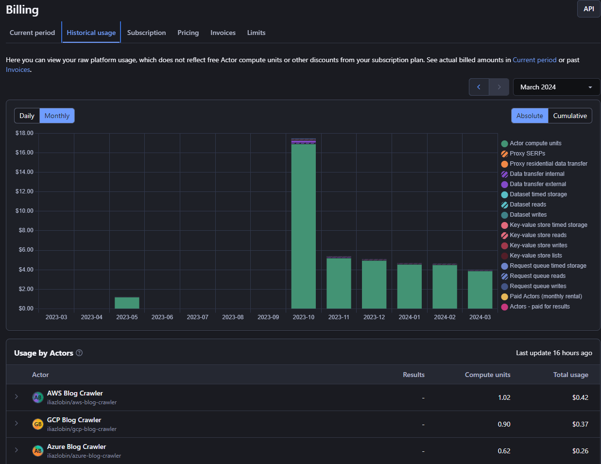
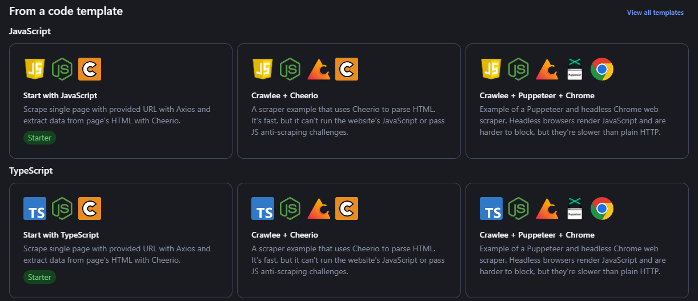
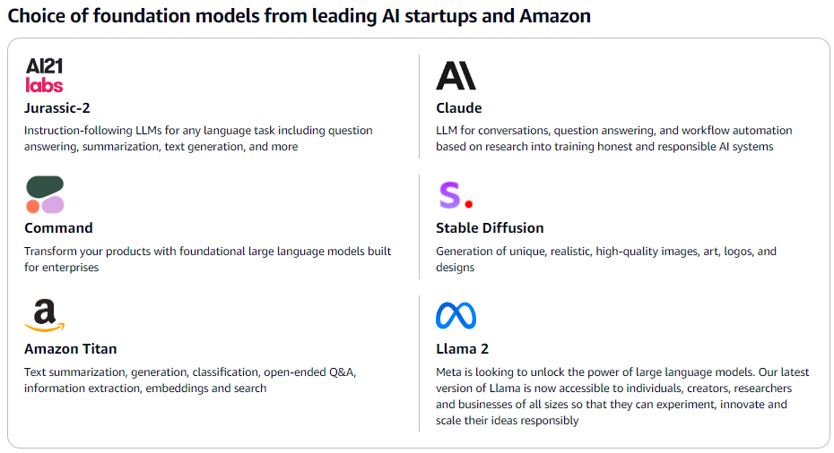
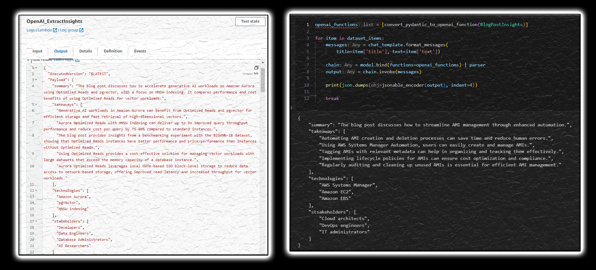

LLMs provide incredible capabilities at working with text in various ways and at a big scale.

As a cloud architect one of the things I found it works incredibly well is for is content summarization….

## System Architecture


AWS Step Functions has been used as a automation engine cause it offers production ready capabilities in the cloud as well as various convenient features for controlling execution flow in an event-driven fashion, leveraging parallelization, logic flow, data mapping, error handling and retries, and granular observability. It also allows you to construct the logic in a visual builder accelerating development flow while offering a capability to export and define the logic in a declarative manner using IaC approach.

It also goes along with [AWS Serverless Application Model](https://aws.amazon.com/serverless/sam/) that outlines a standard process in setting up your serverless application involving API Gateway to glue various services together and enforcing security and standardization. API Gateway also provides security features for endpint authentication and allows you to set up consumption plans to not overload the endpoints by the increasing number of incoming requests.

While scaping design in this particular solution revolves around Apify SaaS, AWS native offerings such as Lambda, ECS, EKS could also be considered for this purpose for further standardization withing AWS ecosystem cause that would offer much more significant benefits in terms of better security, higher cost savings, design robustness, etc especially when going down the road of an enterprise ready solution.

OpenAI is arguably the most powerful LLM engine offering fast and reliable API and matured client libraries making it a smart choice for initial design. They’ve also been the first ones who’ve implemented function calling through their API which is important feature for the tasks like when you need to extract particular information form the corpus of texts in a stable manner. To put simply, function calling guarantees an output format received form LLM which is important thing to reduce the number of retries on errors when parsing the output by the backend.

Finally, Notion is just a good interface if you don’t want to build your own frontend offering databases on the pages to structure and filter through information in a table form. Notion also has a great API to ingest and extract data from the service without severe limitations.

## Apify for Crawling Web Pages

For low usage when scraping content, Apify could be just fine offering a low tier creator plan with with free credits provided.



The good news about Apify is that you can always ports your crawlers to cloud compute environment rather easily cause they’re build on top of open source scraping (puppeteer, cheerio, crawlee, etc) libraries with [Apify offering a set of wrapper libraries](https://github.com/apify) to execute anywhere you want.





[Langchain framework](https://blog.langchain.dev/tag/release-notes/) has matured enough to make code integration nice and smooth. Function calling becomes as straightforward as defining a Pydantic class in Python with a parser extracting information from the OpenAI response into the corresponding structure.

```javascript
class BlogPostInsights(BaseModel):
    """Blog post insights."""

    summary: str = Field(description="one sentence sumamry of the blog post")
    takeaways: List[str] = Field(
        description="3-5 (depending on the length of the blog post) key takeaways from the blog post"
    )
    technologies: List[str] = Field(
        description="the key cloud services and technologies mentioined in the blog post"
    )
    stakeholders: List[str] = Field(
        description="groups of stakeholders who would be interested in the blog post"
    )

def get_blog_post_insights(title, text, cloud):
    chat_template = ChatPromptTemplate.from_messages(
        [
            SystemMessage(
                content=(
                    "You are a professional cloud architect with solid analytic skills. "
                    "You know everything about {cloud} and are always up to date with the latest news. "
                    "You excel at analyzing blog post articles taking clear summaries and takeaways. "
                )
            ),
            HumanMessagePromptTemplate.from_template(
                "I want you to analize this blog post and provide me with the key insights about it. "
                "Blog post title: {title}. "
                "Blog post text: {text}. "
            ),
        ]
    )
    //...

		openai_functions = [convert_pydantic_to_openai_function(BlogPostInsights)]
		parser = PydanticOutputFunctionsParser(pydantic_schema=BlogPostInsights)
		chain = model.bind(functions=openai_functions) | parser
		output = chain.invoke(messages) // BlogPostInsights object
```



##
