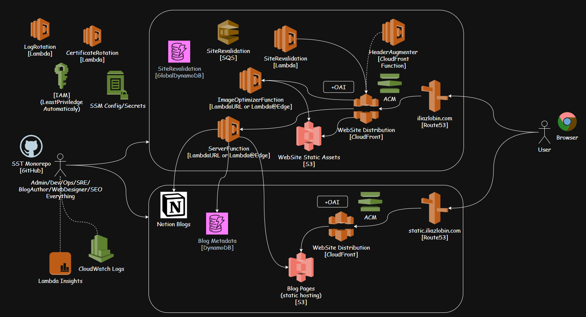

# Web Site

## Project Overview

This is a modern web application built with [Next.js](https://nextjs.org/), designed to serve as the frontend for the iliazlobin-sst cloud automation and blog summarization platform. It provides a fast, scalable, and developer-friendly interface for viewing, managing, and interacting with summarized blog content and cloud automation workflows.

## Features

- **Next.js 14+**: Fast, server-rendered React framework with file-based routing.
- **App Directory Structure**: Uses the new Next.js app directory for modular, scalable code.
- **Live Reload & Hot Module Replacement**: Instant feedback during development.
- **Font Optimization**: Uses [`next/font`](https://nextjs.org/docs/basic-features/font-optimization) for automatic Google Font loading.
- **Custom API Integration**: Connects to backend APIs for blog summarization and cloud automation.
- **Ready for Vercel Deployment**: Optimized for seamless deployment on Vercel.
- **TypeScript Support**: Type-safe development for reliability and maintainability.
- **Tailwind CSS**: Utility-first CSS for rapid UI development.

## Architecture / Tech Stack

- **Frontend**: Next.js (React), TypeScript, Tailwind CSS
- **Backend Integration**: Connects to iliazlobin-sst APIs (see main repo)
- **Font Optimization**: next/font
- **Deployment**: Vercel, SST (Serverless Stack Toolkit)
- **Testing**: (Add details if you have test setup)
- **Other**: ESLint, Prettier, pnpm

### High-Level System Design

The diagram below illustrates the main components and data flow in the platform:



- **User Browser**: End users access the web app via their browser.
- **Next.js Web App**: Serves the frontend UI, handles routing, and communicates with backend APIs.
- **API**: Provides endpoints for blog summarization and cloud automation.
- **Cloud Services**: Includes AWS Lambda, S3, CloudFront, DynamoDB, and other managed services for scalability and automation.
- **Notion & OpenAI**: Integrates with Notion for blog data and OpenAI for summarization.

This architecture ensures a scalable, secure, and maintainable platform for both automation and content delivery.

## Installation & Setup

### Prerequisites

- Node.js (v18+ recommended)
- pnpm, npm, or yarn

### Steps

1. **Install dependencies**
	 ```bash
	 pnpm install
	 # or
	 npm install
	 # or
	 yarn install
	 ```

2. **Run the development server**
	 ```bash
	 pnpm dev
	 # or
	 npm run dev
	 # or
	 yarn dev
	 # or
	 bun dev
	 ```

3. **Open the app**
	 - Visit [http://localhost:3000](http://localhost:3000) in your browser.

4. **Edit pages**
	 - Modify files in `app/` (e.g., `app/page.tsx`). Changes auto-update in the browser.

## Usage Examples

- **Start development server**
	```bash
	pnpm dev
	```
- **View the site**
	- Go to [http://localhost:3000](http://localhost:3000)

- **Edit a page**
	- Change `app/page.tsx` and see live updates.

## Configuration

- **Environment Variables**: Add any required variables to `.env.local` (see Next.js docs for details).
- **Config Files**: See `next.config.mjs` for custom Next.js configuration.
- **Tailwind CSS**: Configured via `tailwind.config.ts`.
- **Font Optimization**: Managed in code via `next/font`.

## Development Guide

- **Contributing**: Fork the repo, create a feature branch, submit a PR.
- **Testing**: (Add details if you have test setup, e.g., `pnpm test`)
- **Linting/Formatting**: Run `pnpm lint` and `pnpm format` (if configured).
- **CI/CD**: Recommended to use Vercel for automatic deployments on push.

## Deployment

### Vercel

- Click “Deploy” on [Vercel](https://vercel.com/new?utm_medium=default-template&filter=next.js&utm_source=create-next-app&utm_campaign=create-next-app-readme)
- Or run:
	```bash
	vercel --prod
	```

### Custom Cloud / Docker

- See [Next.js deployment documentation](https://nextjs.org/docs/deployment) for Docker, Kubernetes, or custom cloud setups.

## Additional Resources

- [Next.js Documentation](https://nextjs.org/docs)
- [Learn Next.js](https://nextjs.org/learn)
- [Vercel Platform](https://vercel.com/)
- [Tailwind CSS](https://tailwindcss.com/)

---

This README provides a clear, structured guide for new users and contributors. For backend/API details, see the main iliazlobin-sst repository.
